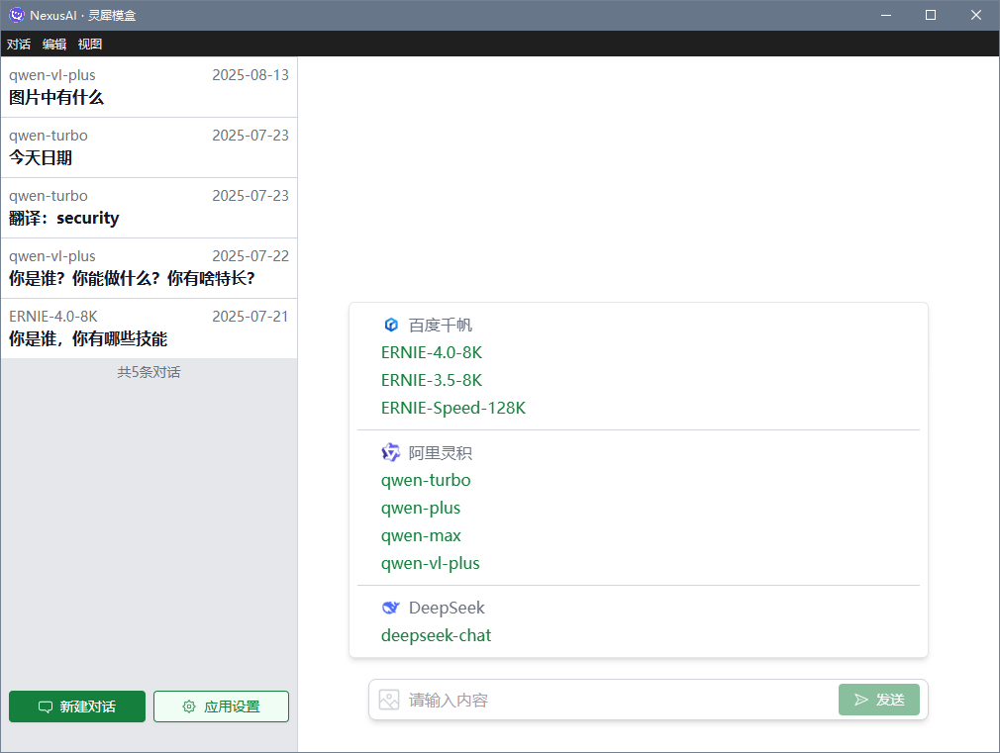
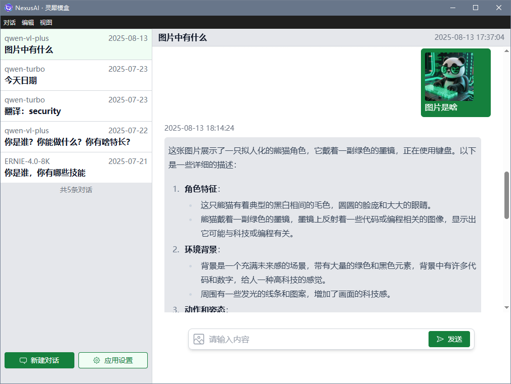
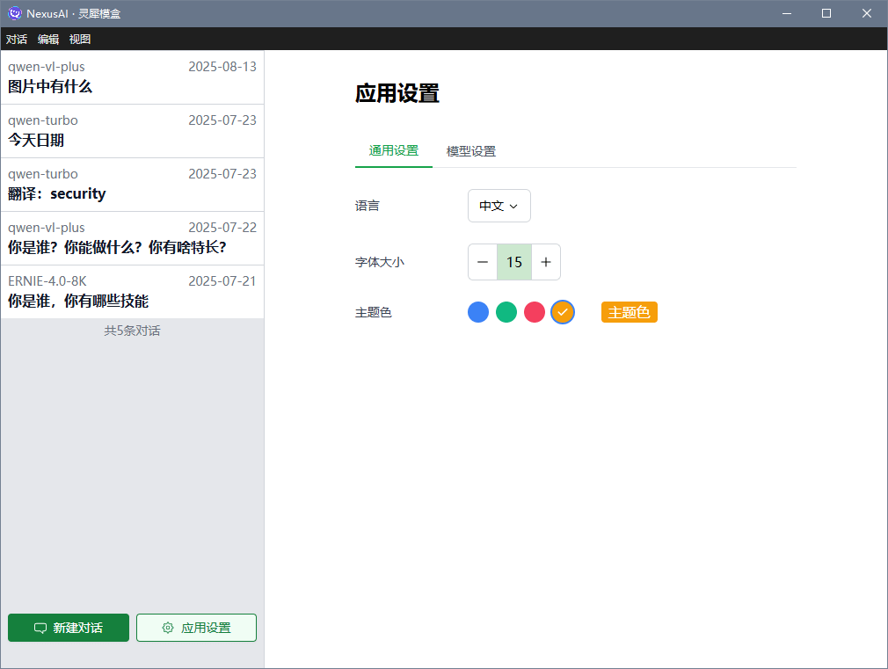
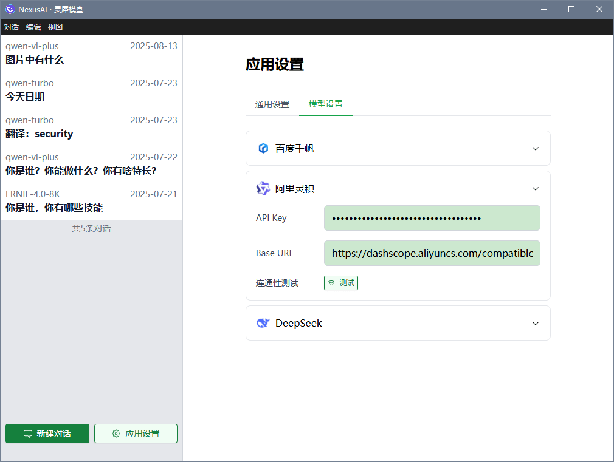

# imooc-vchat

<p align="center">
  
  <br>
  <em>VChat 是一个基于 Vue 3 + Electron 构建的跨平台 AI 聊天桌面应用，支持多个主流大语言模型 Provider，提供流畅的对话体验。</em>
</p>


## course

> [慕课网 | Al助手Cursor辅助 Vue3.5+Electron+ 大模型跨平台实战](https://coding.imooc.com/class/921.html)
>
> [https://github.com/marlonchiu/imooc-vchat](https://github.com/marlonchiu/imooc-vchat)

## 📷 应用预览








## 特性

- 🚀 基于 Electron + Vue 3 + TypeScript 开发
- 💬 支持多种 AI 模型接入（百度千帆、阿里通义千问、DeepSeek）
- 🎨 现代化的用户界面设计
- 📱 跨平台支持（Windows、macOS、Linux）
- 🔒 本地数据存储，保护隐私
- 🎯 支持 Markdown 格式消息
- 🌙 深色模式支持

## 待完善功能

- 🌐 多语言支持
  - 更多语言支持计划中
- 🎨 主题定制
  - 自定义主题色
  - 主题切换动画
  - 更多主题模板
- 🤖 AI 模型设置
  - 模型参数自定义
  - 默认模型设置
  - 模型切换快捷键
- 📱 界面优化
  - 响应式布局优化
  - 移动端适配
  - 更多自定义选项
- 🔄 功能增强
  - 对话导出
  - 历史记录搜索
  - 快捷指令
  - 更多 AI 模型接入

## 快速开始

### 环境要求

- Node.js 16+
- npm 或 yarn

### 安装

1. 克隆项目

```bash
git clone https://gitee.com/linkgeek/vchat.git
cd vchat
```

2. 安装依赖

```bash
npm install
```

3. 配置环境变量
   创建 `.env` 文件，并添加以下配置：

```env
QIANFAN_ACCESS_KEY=百度千帆AK
QIANFAN_SECRET_KEY=百度千帆密钥
ALI_API_KEY==阿里通义千问API密钥
GITHUB_TOKEN=你的github token
```

4. 启动开发服务器

```bash
npm start
```

### 构建

构建生产版本：

```bash
npm run make
```

## 项目结构

```
vchat/
├── assets/              # 静态资源
├── src/                 # 源代码
│   ├── compoents/       # 组件
│   ├── config/          # 配置目录
│   ├── i18n/            # 多语言设置
│   ├── locales/         # 语言包
│   ├── providers/       # 大模型提供者
│   ├── stores/          # 状态管理
│   ├── views/           # 视图页
│   ├── config.ts        # 配置操作
│   ├── db.ts            # 数据存储
│   ├── ipc.ts           # 渲染进程和主进程间的通信
│   ├── main.ts          # 主进程
│   ├── menu.ts          # 应用顶部菜单栏
│   ├── preload.ts       # 主进程与渲染进程通信预加载脚本
│   ├── renderer.ts      # 渲染进程

│   └── types.ts         # TypeScript 类型定义

├── command_history.md/  # 历史命令
├── forge.config.ts/     # 打包等配置
├── interface.d.ts/      # 接口定义
└── ...
```

## 技术栈

- Electron - 跨平台桌面应用框架
- Vue 3 - 前端框架
- TypeScript - 类型安全的 JavaScript
- Tailwind CSS - 样式框架
- Pinia - 状态管理
- Vite - 构建工具

## 警告
1. 本项目仅用于学习
2. 本项目还不完善，仍处在开发中，不承担任何使用后果


## 致谢

本项目基于或参考以下项目：
1. [vchat](https://github.com/linkgeek/vchat)

2. [vchat](https://github.com/tyler4400/vchat)

3. [UmChat](https://github.com/lunarise-dev/UmChat)

## 打包常见问题及解决
用electron-forge打包时巨慢，可能会出现各种问题。

> npm下载electron失败：
  $env:ELECTRON_MIRROR="https://npmmirror.com/mirrors/electron/"

> 下载或打包超时, 尝试: 用管理员模式

## License

MIT License
